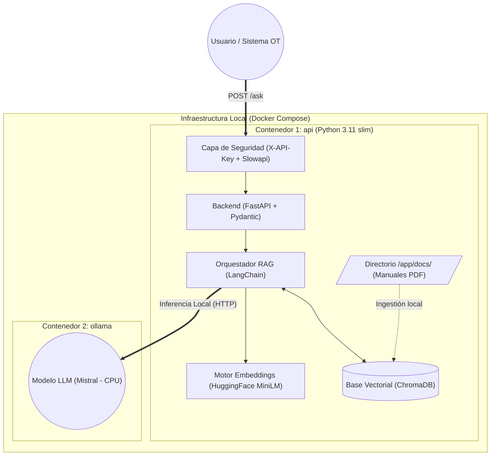
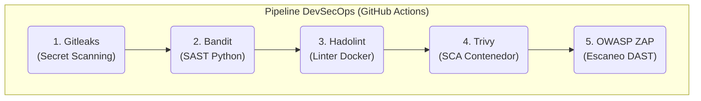

```mermaid
flowchart TD
    %% Capa de Usuario
    User(("Usuario / Sistema OT"))

    %% Infraestructura Principal (Contenedores)
    subgraph Docker_Host ["Infraestructura Local (Docker Compose)"]
        direction TB
        
        subgraph API_Container ["Contenedor 1: api (Python 3.11 slim)"]
            direction TB
            Security["Capa de Seguridad (X-API-Key + Slowapi)"]
            FastAPI["Backend (FastAPI + Pydantic)"]
            LangChain["Orquestador RAG (LangChain)"]
            Embeddings["Motor Embeddings (HuggingFace MiniLM)"]
            Chroma[("Base Vectorial (ChromaDB)")]
            Docs[/"Directorio /app/docs/ (Manuales PDF)"/]
            
            Security --> FastAPI
            FastAPI --> LangChain
            LangChain --> Embeddings
            LangChain <--> Chroma
            Docs -. "Ingestión local" .-> Chroma
        end
        
        subgraph Ollama_Container ["Contenedor 2: ollama"]
            direction TB
            LLM(("Modelo LLM (Mistral - CPU)"))
        end
        
        %% Conexiones internas
        LangChain == "Inferencia Local (HTTP)" ==> LLM
    end

    %% Flujo de Petición
    User == "POST /ask" ==> Security
```

```mermaid
flowchart LR
    %% Capa DevSecOps
    subgraph CI_CD ["Pipeline DevSecOps (GitHub Actions)"]
        direction LR
        Gitleaks("1. Gitleaks\n(Secret Scanning)")
        Bandit("2. Bandit\n(SAST Python)")
        Hadolint("3. Hadolint\n(Linter Docker)")
        Trivy("4. Trivy\n(SCA Contenedor)")
        ZAP("5. OWASP ZAP\n(Escaneo DAST)")
        
        Gitleaks --> Bandit --> Hadolint --> Trivy --> ZAP
    end
```