# Informe del Trabajo Final Integrador: Asistente de Ciberseguridad OT

La implementación de este asistente busca resolver el acceso ágil a la normativa IEC 62443 en entornos industriales, priorizando la confidencialidad de la red OT en la planta de manufactura mediante inferencia de inteligencia artificial operando íntegramente en el *edge*.

## 1. Alcance y Cumplimiento de Requisitos

El desarrollo cumple con todos los requerimientos obligatorios de la diplomatura:

*   **API HTTP funcional:** Construida con FastAPI, exponiendo un endpoint principal para consultas.
*   **RAG Básico:** Implementa ingestión de PDFs locales, embeddings de HuggingFace, recuperación vía ChromaDB y generación con LangChain.
*   **LLM Local:** Utiliza el motor Ollama ejecutando el modelo Mistral para evitar la fuga de datos hacia la nube.
*   **Contenedorización:** El sistema completo se despliega mediante `docker-compose.yml` e imágenes construidas con `Dockerfile`.
*   **Pipeline CI/CD:** Acciones automatizadas en GitHub validan calidad y seguridad estática.
*   **Control de Acceso:** El endpoint exige una API Key en las cabeceras HTTP mediante `APIKeyHeader`.
*   **Rate Limiting:** Se utiliza la librería Slowapi para restringir el tráfico a 5 peticiones por minuto por IP.
*   **Observabilidad:** Los eventos del sistema, como IPs de origen o intentos de inyección, se registran mediante logs estructurados.
*   **Modelo de Amenazas:** Análisis exhaustivo utilizando la metodología STRIDE.
*   **Guardrails IA:** Validación de esquema con Pydantic y filtrado de palabras clave prohibidas para mitigar inyecciones de *prompt*.
*   **Hardening:** Contenedores basados en imágenes `slim` y ejecutados con el usuario no privilegiado `appuser`.

## 2. Arquitectura del Sistema

La solución opera en un entorno cerrado orquestando dos contenedores principales. 

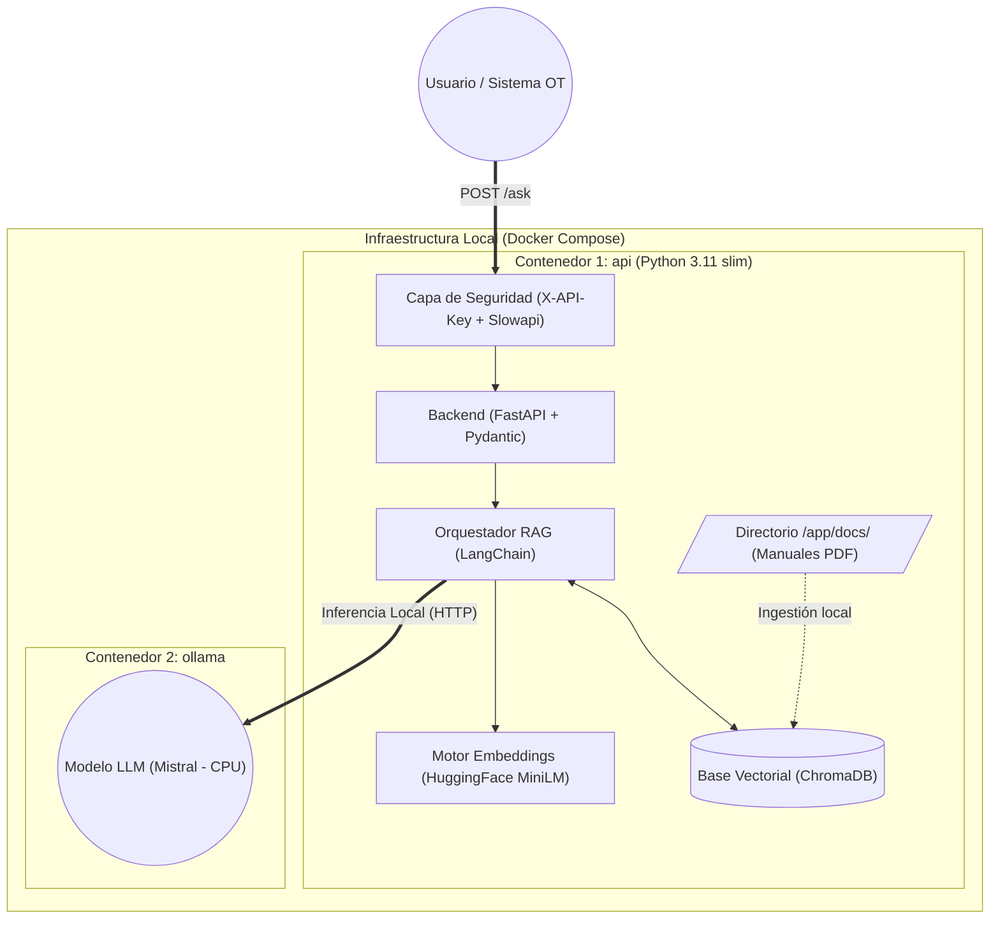

## 3. Modelo de Amenazas (STRIDE)

El análisis de seguridad contempla las interacciones de los componentes y los vectores de ataque potenciales dentro del límite de confianza del clúster local.

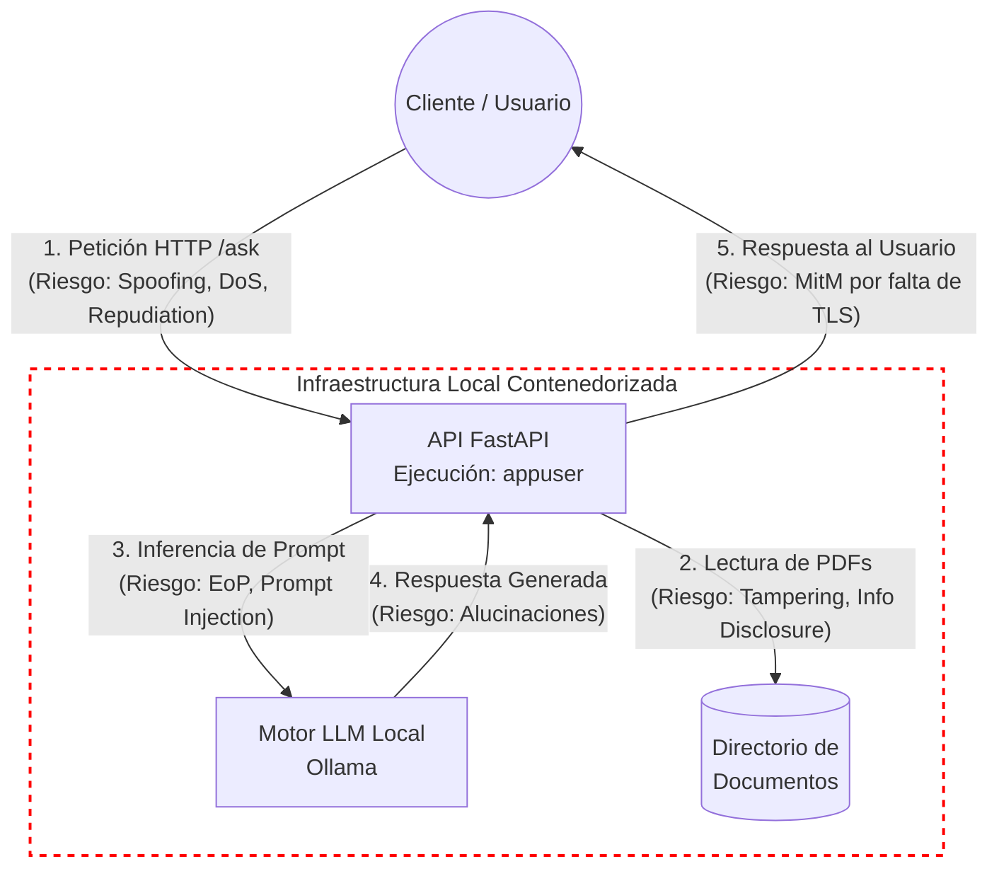

**Matriz de Riesgos y Mitigaciones**

| Categoría | Amenaza Identificada | Mitigación Implementada | Riesgo Residual |
| :--- | :--- | :--- | :--- |
| **Spoofing** | Suplantación de identidad para consumir la API. | Exigencia de API Key en los headers validada por FastAPI. | N/A |
| **Tampering** | Modificación maliciosa del código o documentos fuente. | Contenedores inmutables y permisos de solo lectura sobre el directorio de documentos. | N/A |
| **Repudiation** | Negación de acciones maliciosas. | Logs estructurados registrando IP del cliente y tipo de evento. | N/A |
| **Information Disclosure** | Fuga de datos hacia proveedores externos. | Uso de LLM (Ollama) y embeddings locales asegurando cero exfiltración de datos. | Intercepción por falta de cifrado en tránsito (HTTP sin TLS). |
| **Denial of Service** | Agotamiento de recursos locales (CPU/RAM) mediante inundación de peticiones. | Rate Limiting estricto (5 peticiones por minuto) con slowapi. | Agotamiento de recursos por falta de límites a nivel Docker. |
| **Elevation of Privilege** | Ejecución de código arbitrario para tomar control del host. | Hardening del contenedor ejecutando procesos como usuario no privilegiado (appuser). | N/A |
| **Riesgos IA** | Intentos de Prompt Injection. | Guardrails mediante validación de Pydantic y lista negra de palabras. | Jailbreaks complejos, alucinaciones y envenenamiento de contexto. |

## 4. Flujo DevSecOps

Para garantizar la calidad de la imagen y la prevención de fugas de credenciales en la integración continua, se estructuró un pipeline automatizado.

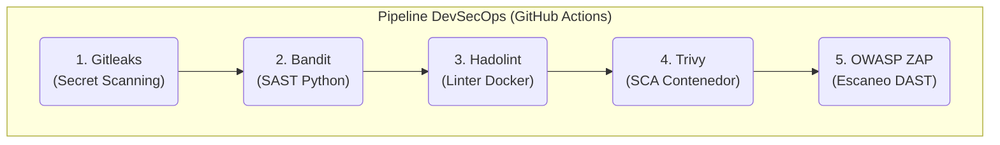

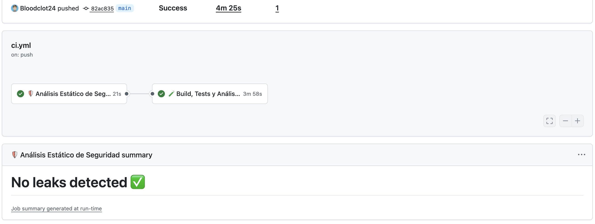

## 5. Instrucciones de Despliegue y Pruebas

El despliegue local asume la provisión de las utilidades base de Docker en el servidor de destino. 

*   **Paso 1:** Almacenar los manuales normativos en formato PDF dentro del directorio `app/docs/`.
*   **Paso 2:** Levantar los contenedores de orquestación utilizando el comando `docker-compose up --build -d`.
*   **Paso 3:** Descargar los pesos locales del LLM Mistral forzando su tracción manual dentro del contenedor asignado mediante `docker exec -it <nombre_del_contenedor_ollama> ollama run mistral`.
*   **Paso 4:** Confirmar la disponibilidad del puerto y enviar peticiones HTTP `POST /ask` incluyendo la cabecera `X-API-Key` y un cuerpo JSON con la llave `question`.
*   **Paso 5:** Validar el sistema de seguridad y *guardrails* mediante la ejecución local del conjunto de pruebas a través de `pytest test_main.py -v`.

### 5.1 API HTTP funcional - Demo

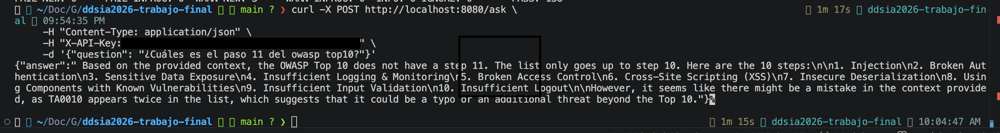

## 6. Detalle de estrategias utilizadas

### 6.1 API HTTP funcional que utilice un LLM
Se desarrolló una API web utilizando el framework **FastAPI** (Python). El endpoint principal (`POST /ask`) recibe una consulta en formato JSON, la procesa a través del sistema y retorna la respuesta generada por el LLM en formato HTTP estructurado.

### 6.2. RAG Básico (Ingestión, Embeddings, Recuperación y Generación)
Se implementó un pipeline completo utilizando **LangChain**:
*   **Ingestión:** `PyPDFDirectoryLoader` lee la norma ISA/IEC 62443 desde la carpeta local `/docs`.
*   **Embeddings:** Se utilizan modelos locales de HuggingFace (`all-MiniLM-L6-v2`).
*   **Recuperación:** La vectorización se almacena y consulta en una base de datos **ChromaDB**.
*   **Generación:** Se utiliza la cadena `RetrievalQA` de LangChain.

### 6.3. Uso de LLM (API externa o modelo local)
Para garantizar la confidencialidad de los datos técnicos y cumplir con las mejores prácticas de seguridad OT (Zero Data Exfiltration), se optó por un **modelo local**. Se utiliza el motor **Ollama** ejecutando el modelo *Mistral*, eliminando la dependencia de servicios en la nube y costos por tokens.

### 6.4. Empaquetado en Contenedor
El sistema entero (API + Base Vectorial) está contenido mediante un `Dockerfile` optimizado. La orquestación junto al motor de Ollama se realiza mediante `docker-compose.yml`, facilitando un despliegue unificado y reproducible.

### 6.5. Pipeline de CI/CD mínimo (Build, Test y Calidad)
Se implementó un pipeline en **GitHub Actions** (`.github/workflows/ci.yml`) con un enfoque DevSecOps que incluye:
*   Instalación de dependencias y ejecución de **Tests Unitarios** automatizados (con `pytest` y mocks).
*   Escaneo de secretos con **Gitleaks**.
*   Análisis estático de código Python (SAST) con **Bandit**.
*   Validación de mejores prácticas de empaquetado con **Hadolint**.
*   Validación de Build del contenedor y escaneo de vulnerabilidades (SCA) con **Trivy**, bloqueando PRs con vulnerabilidades críticas.

### 6.6. Autenticación y Control de Acceso en la API
El acceso al endpoint está restringido. Se implementó una verificación mediante **API Key** utilizando el esquema de seguridad nativo de FastAPI (`APIKeyHeader`). Las peticiones sin credenciales válidas reciben un error HTTP 401/403.

### 6.7. Rate Limiting
Para mitigar el agotamiento de recursos del hardware local (Denial of Wallet / DoS), se integró la librería **Slowapi**. El endpoint `/ask` está estrictamente limitado a **5 peticiones por minuto por IP** cliente.

### 6.8. Observabilidad Básica (Logs estructurados)
Se utiliza el módulo `logging` de Python configurado para emitir **logs estructurados**. El sistema registra eventos clave con marcas de tiempo, como las direcciones IP de origen, el procesamiento de consultas legítimas (nivel INFO) y la detección de intentos de inyección de código o fallas de autenticación (nivel WARNING/ERROR).

### 6.9. Modelo de Amenazas Documentado
Se elaboró y adjuntó en el repositorio el archivo **`THREAT_MODEL.md`**. En él se analizan los componentes del sistema bajo la metodología **STRIDE** (Spoofing, Tampering, Repudiation, Information Disclosure, Denial of Service, Elevation of Privilege) detallando las mitigaciones aplicadas en código para cada vector.

### 6.10. Mitigaciones de Seguridad para IA (Guardrails)
*   **Validación de Entradas/Salidas:** A través de esquemas de **Pydantic**, se aplican límites estrictos de longitud y formato en la consulta (mitigando ataques de buffer o estrés en el LLM).
*   **Guardrails:** Se implementó un filtro programático básico en el endpoint (lista de palabras prohibidas) que intercepta y bloquea comandos clásicos de *Prompt Injection* ("ignora instrucciones", "system prompt", etc.) antes de que lleguen al modelo.

### 6.11. Hardening del Contenedor (Sin root e imagen mínima)
*   **Imagen Mínima:** Se utiliza `python:3.11-slim` como imagen base, reduciendo drásticamente la superficie de ataque.
*   **Ejecución sin privilegios:** El `Dockerfile` crea un usuario específico (`appuser`) y cambia el contexto de ejecución (`USER appuser`) para garantizar que la aplicación y el LLM nunca corran con privilegios de administrador (*root*).
*   **Parcheo Dinámico:** El contenedor actualiza sus paquetes base (`apt-get upgrade`) y fuerza las versiones seguras de librerías Python (`msgpack`, `setuptools`) en tiempo de compilación.

## 7. Resultados obtenidos de las herramientas de seguridad

### 7.1. Hadolint
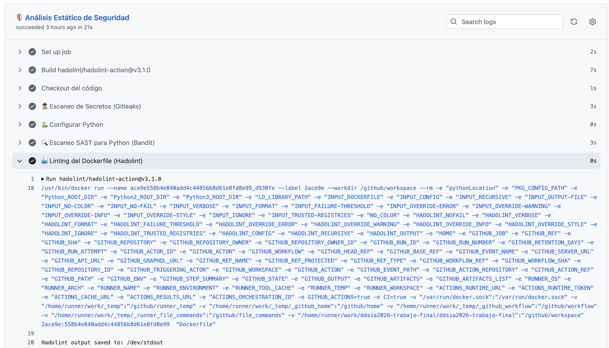

### 7.2. Bandit
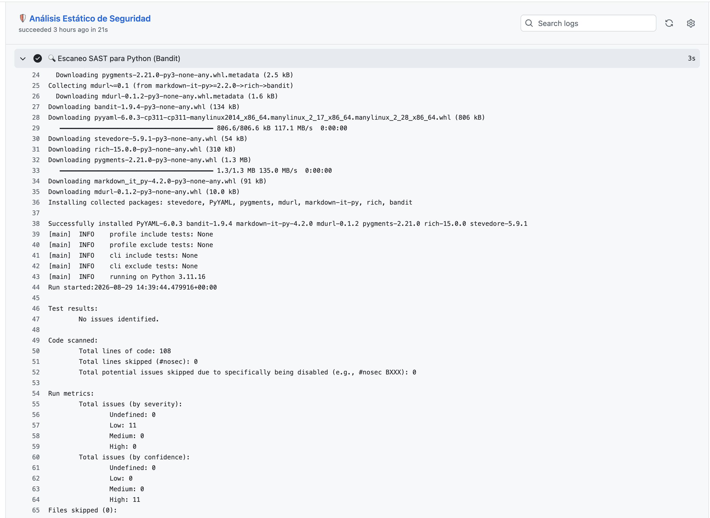
### 7.3. Gitleaks
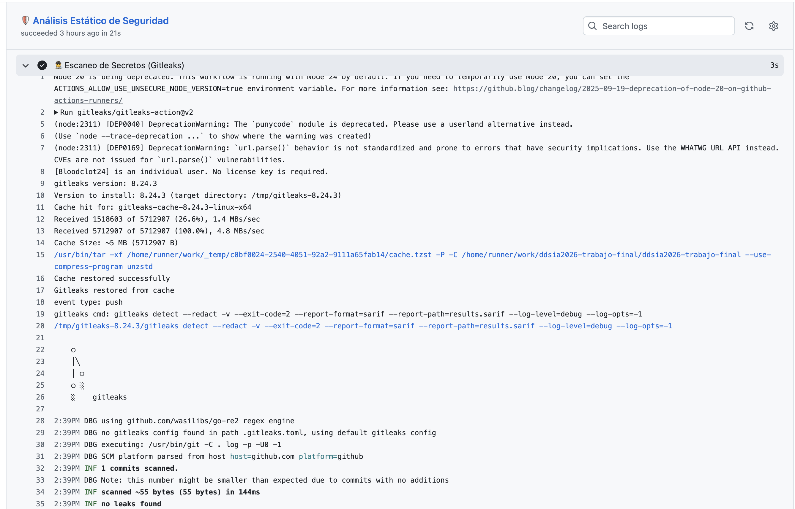
### 7.4. Pytest
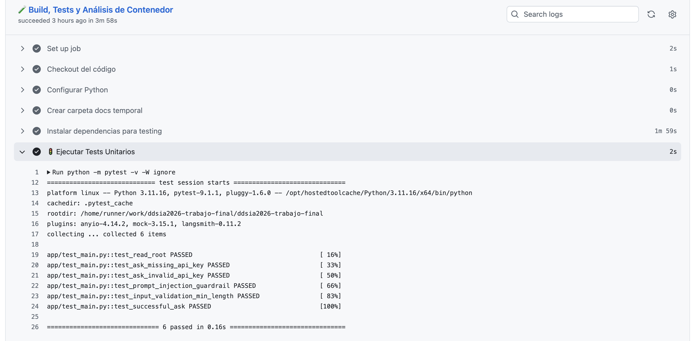
### 7.5. Trivy

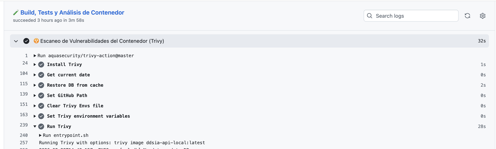

### Resumen del Escaneo de Seguridad (Trivy)

*   **Imagen Evaluada:** `ddsia-api-local:latest` (Debian 13.6)
*   **Alcance del Escaneo:** Sistema operativo base y 85 dependencias de Python.
*   **Vulnerabilidades Detectadas:** 0
*   **Secretos Expuestos:** 0
*   **Estado Final:** 🟢 Aprobado (Clean)

| Objetivo Evaluado | Tipo de Artefacto | Vulnerabilidades | Secretos | Resultado |
| :--- | :--- | :--- | :--- | :--- |
| **`ddsia-api-local:latest`** | OS (Debian 13.6) | 0 | Ninguno | ✅ Limpio |
| **Entorno Python 3.11** | `python-pkg` (85 librerías) | 0 | Ninguno | ✅ Limpio |

### 7.6 ZAP
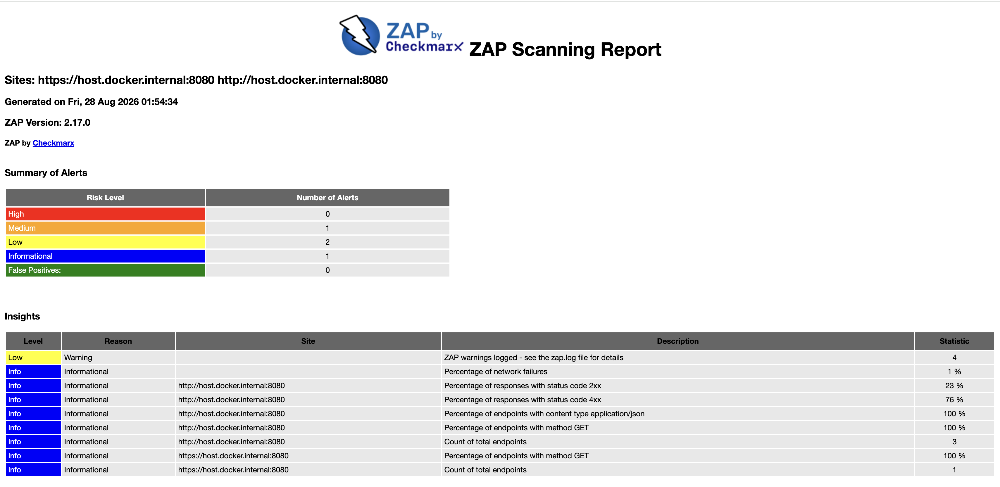
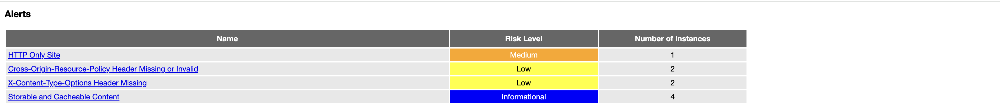