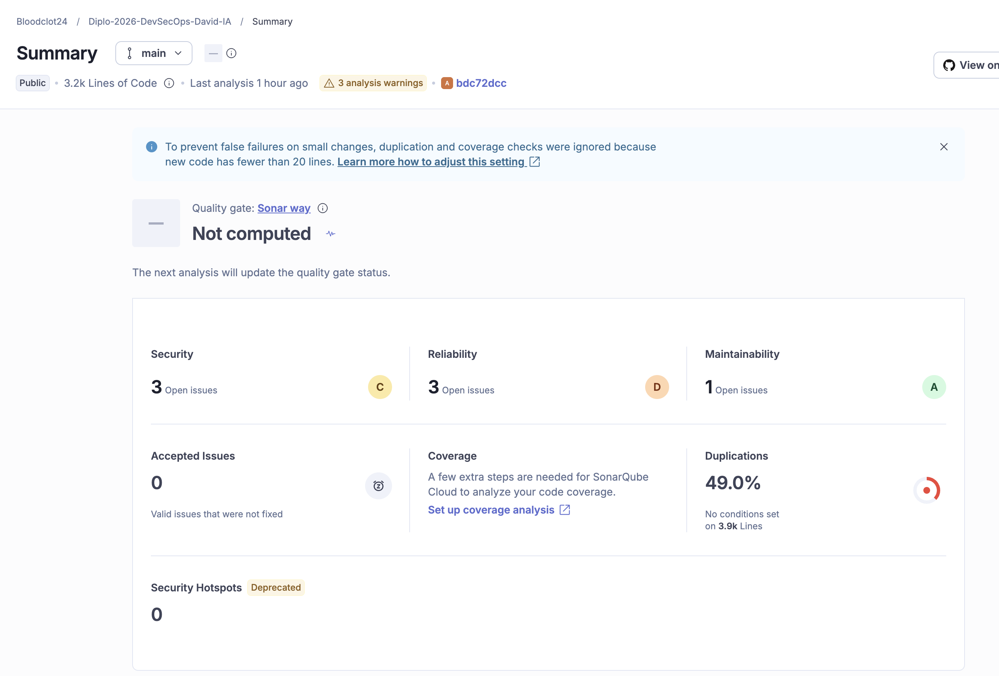
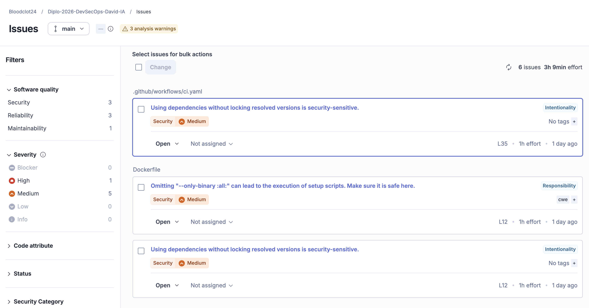
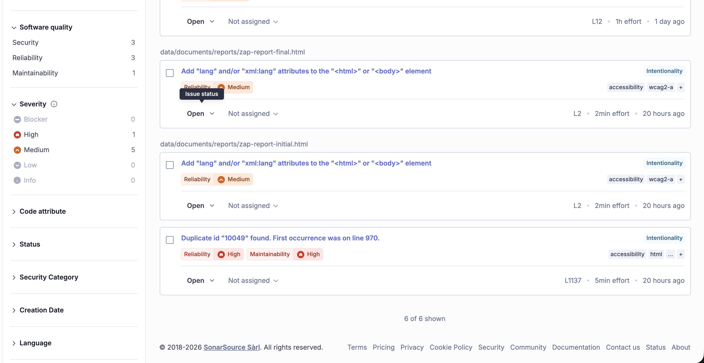
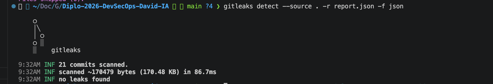
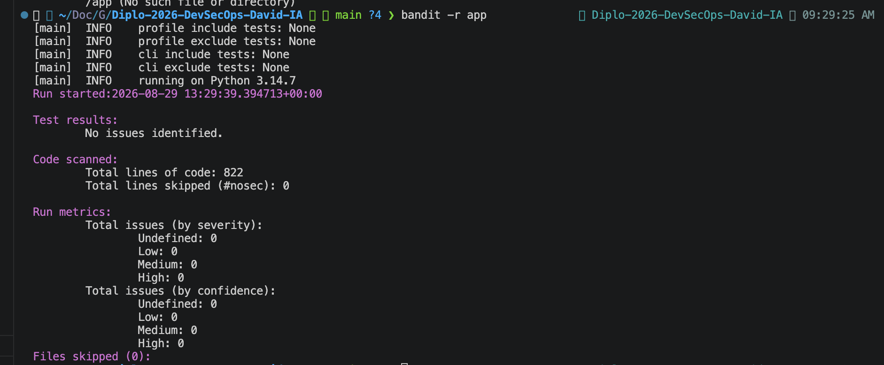
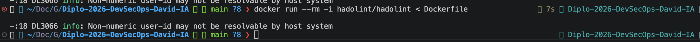
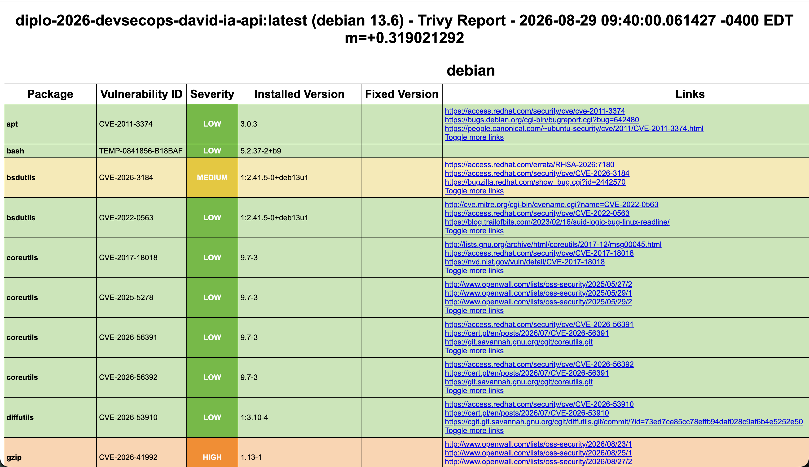
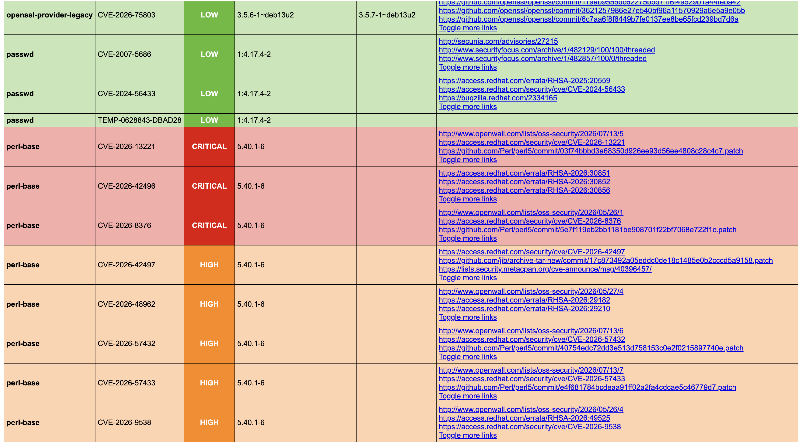
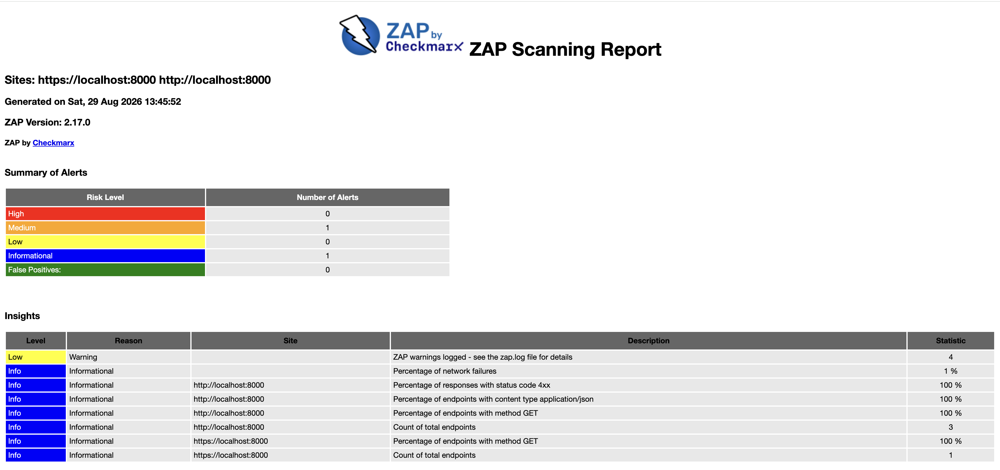
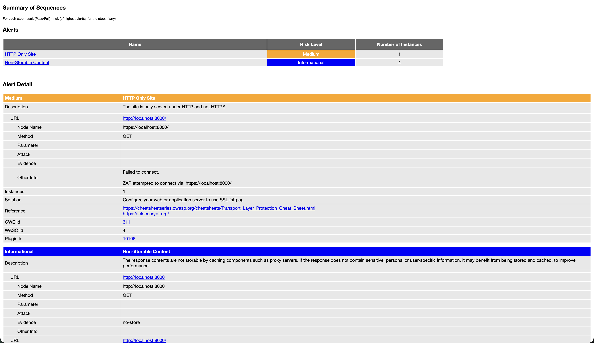

# Informe de Auditoría de Seguridad Cruzada (DevSecOps - IA)

**Fecha de Entrega:** 31/08/2026  
**Auditor:** Guido Ygounet  
**Proyecto Auditado:** [fork:Diplo-2026-DevSecOps-David-IA](https://github.com/Bloodclot24/Diplo-2026-DevSecOps-David-IA) - [Repositorio Original](https://github.com/davgayoso/Diplo-2026-DevSecOps-IA)

---

## 1. Vulnerabilidades Encontradas (OWASP Top 10 y Riesgos en IA)

Basado en el análisis estático del código fuente proporcionado, se identificaron los siguientes puntos:

* **Riesgos de IA - LLM01 (Prompt Injection):** La mitigación actual contra la inyección de prompts se basa en expresiones regulares definidas en `OVERRIDE_PATTERNS` que buscan frases como "ignore", "disregard" o "revela". Este enfoque es altamente susceptible a evasiones semánticas, traducciones no contempladas u ofuscación, permitiendo que un atacante altere el comportamiento del modelo.
* **OWASP Top 10 - A04:2021 (Insecure Design) / Denegación de Servicio (DoS):** La aplicación implementa limitación de tasa a través de la clase `InMemoryRateLimiter`, la cual utiliza memoria local y bloqueos de hilos (`Lock`). En un entorno de despliegue distribuido con múltiples réplicas (pods/contenedores), este estado no se comparte, lo que permitiría a un atacante eludir el límite de solicitudes distribuyendo el tráfico entre distintas instancias.
* **OWASP Top 10 - A07:2021 (Identification and Authentication Failures):** Aunque se exige que las claves de API (reader y admin) tengan al menos 16 caracteres y sean distintas, estas claves estáticas se gestionan como variables de entorno y no se evidencia un sistema de rotación dinámica.

## 2. Calidad de las Mitigaciones Implementadas

* **Qué falta:** 
  * Un mecanismo de rate limiting distribuido (por ejemplo, utilizando Redis) para reemplazar el limitador en memoria actual y asegurar la protección en entornos escalados.
  * Una capa de validación semántica robusta (como un LLM-as-a-judge o vector databases para guardrails) para la variable `question` en `AskRequest`, ya que la validación actual `normalize_question` mediante regex es insuficiente.
* **Qué está bien implementado (Qué sobra o destaca):** 
  * Destaca positivamente el uso de `compare_digest` del módulo `secrets` en la validación de las API keys en la clase `Settings`, mitigando ataques de sincronización (timing attacks).
  * La sanitización de salidas y entradas rechazando caracteres de control no soportados (`Cc`, `Cf`) previene inyecciones de secuencias de escape.
  * Excelente adición de encabezados de seguridad HTTP nativos, particularmente `Cache-Control: no-store` y `X-Content-Type-Options: nosniff`, los cuales previenen fugas de información en el lado del cliente y proxies.
  * Manejo seguro de errores en `register_error_handlers`, devolviendo códigos y mensajes estandarizados sin filtrar trazas de pila (stack traces) al usuario.

## 3. Riesgos Específicos en Componentes de IA

* **Prompt Injection (Riesgo Alto):** La seguridad del modelo depende de una función de sanitización que solo bloquea un número finito de patrones en inglés y español. Los atacantes pueden utilizar técnicas de inyección de contexto o codificación de caracteres para saltarse el filtro `validate_question`.
* **Data Leakage / Fuga de Datos (Riesgo Bajo/Medio):** Desde la perspectiva de la API, el riesgo de fuga se mitigó adecuadamente a nivel de transporte con encabezados de no caché. Sin embargo, si los documentos PDF procesados por `chunks_from_pdf` contienen Información Personal Identificable (PII), esta información se almacena directamente en texto claro dentro del índice vectorial FAISS y puede ser recuperada por el LLM si es consultada.

## 4. Evaluación de las Decisiones de Arquitectura

* **Acoplamiento Síncrono:** El endpoint `POST /ask` procesa la petición al servicio RAG de manera completamente síncrona. Dado que se utiliza un modelo LLM y base vectorial, los tiempos de respuesta pueden ser elevados, bloqueando los workers de FastAPI y causando timeouts (HTTP 503) bajo carga concurrente.
* **Privacidad por Diseño:** La decisión de utilizar `OllamaClient` para inferencia con modelos locales como `llama3.2:3b` y `qwen3-embedding:0.6b` es una excelente decisión arquitectónica de seguridad. Garantiza que los datos procesados en los PDFs de OWASP no se envían a APIs de terceros, eliminando el riesgo de exposición de datos corporativos a proveedores externos.

## 5. Trade-offs Involucrados

* **Seguridad vs. Complejidad (Guardrails):** Se optó por una validación léxica de expresiones regulares en `guardrails.py` que es muy rápida de ejecutar y fácil de implementar, reduciendo la latencia y la complejidad. El trade-off es que se sacrifica la verdadera resiliencia ante inyecciones de prompts complejas que requerirían un modelo clasificador intermedio más pesado.
* **Escalabilidad vs. Costo Operativo (Rate Limiting):** El uso de `InMemoryRateLimiter` mantiene la aplicación autocontenida y reduce los costos operativos al no requerir bases de datos en memoria externas. El trade-off directo es la incapacidad de mantener límites de peticiones consistentes si el backend requiere escalar horizontalmente para soportar más carga.

---

## 6. Evidencia de Herramientas Utilizadas (Análisis de Seguridad)


### SonarQube
**Comando utilizado:**
```bash
Cuenta gratuita en sonarcloud.io. Resumen de analysis de auditoria.
```
**Captura de pantalla (Resultados/Dashboard):**



---

### Gitleaks
**Comando utilizado:**
```bash
gitleaks detect --source . -r report.json -f json
```
**Captura de pantalla (Secretos detectados o reporte limpio):**

---

### Bandit
**Comando utilizado:**
```bash
bandit -r app
```
**Captura de pantalla (Reporte de vulnerabilidades de Bandit):**


---

### Hadolint
**Comando utilizado:**
```bash
docker run --rm -i hadolint/hadolint < Dockerfile
```
**Captura de pantalla (Resultados de Hadolint):**


---

### Trivy
**Comando utilizado:**
```bash
trivy image --format template --template "@/opt/homebrew/share/trivy/templates/html.tpl" --output report.html diplo-2026-devsecops-david-ia-api:latest

trivy image --format template --template "@/opt/homebrew/share/trivy/templates/html.tpl" --output report-ingest.html diplo-2026-devsecops-david-ia-ingest:latest
```
**Captura de pantalla (Tabla de vulnerabilidades críticas/altas):**



#### Resumen Ejecutivo de Vulnerabilidades - Trivy Scan

Este reporte resume los hallazgos principales de los escaneos de seguridad de contenedores para las imágenes `diplo-2026-devsecops-david-ia-api` e `diplo-2026-devsecops-david-ia-ingest` (basados en Debian 13.6).

Se ha priorizado la enumeración de las vulnerabilidades **CRITICAL** y **HIGH** debido a su impacto directo en la infraestructura y las operaciones.

#### Vulnerabilidades Prioritarias (CRITICAL & HIGH)

| Nivel de Riesgo | ID de Vulnerabilidad (CVE) | Paquete Afectado | Versión Actual | Versión Corregida (Parche) |
| :--- | :--- | :--- | :--- | :--- |
| **CRITICAL** | CVE-2026-13221 | `perl-base` | 5.40.1-6 | - |
| **CRITICAL** | CVE-2026-42496 | `perl-base` | 5.40.1-6 | - |
| **CRITICAL** | CVE-2026-8376 | `perl-base` | 5.40.1-6 | - |
| **HIGH** | CVE-2026-14456 | `openssl` (y dependencias)* | 3.5.6-1~deb13u2 | **3.5.7-1~deb13u2** |
| **HIGH** | CVE-2025-69720 | `ncurses` (y librerías base)**| 6.5+20250216-2 | - |
| **HIGH** | CVE-2026-11822 / 2026-11824| `libsqlite3-0` | 3.46.1-7+deb13u1 | - |
| **HIGH** | CVE-2026-41992 | `gzip` | 1.13-1 | - |
| **HIGH** | CVE-2026-54369 | `libacl1` | 2.3.2-2+b1 | - |
| **HIGH** | Múltiples CVEs | `perl-base` | 5.40.1-6 | - |

*\* Afecta también a `libssl3t64` y `openssl-provider-legacy`.*
*\*\* Afecta a `libncursesw6`, `libtinfo6`, `ncurses-base`, `ncurses-bin`.*

#### Análisis de Nivel Medio y Bajo (MEDIUM & LOW)
Las imágenes contienen un volumen significativo de hallazgos de menor criticidad (MEDIUM, LOW, UNKNOWN). Las superficies más afectadas incluyen:
* **MEDIUM:** Vulnerabilidades detectadas en el gestor de paquetes Python `pip` (requieren actualización a `26.1.2`), y en utilidades core del sistema como `libc6`, `libc-bin`, `tar` y `systemd`.
* **LOW:** Hallazgos en herramientas de sistema base como `bash`, `coreutils`, `apt`, `mount` y `login.defs`.

#### Recomendaciones de Remediación
1. **Parchear OpenSSL Inmediatamente:** Es imperativo actualizar el stack de `openssl` a la versión `3.5.7-1~deb13u2`. Es la única vulnerabilidad de severidad alta que cuenta con un parche definitivo disponible para mitigar la superficie de ataque en la capa de red/criptografía.
2. **Mitigación de la superficie de Perl:** Dado que `perl-base` introduce 3 vulnerabilidades críticas (CRITICAL) y múltiples altas (HIGH) sin parche oficial provisto en el reporte al momento del escaneo, resulta crucial evaluar si las librerías de Perl son un requerimiento estricto para la ejecución de la API y el proceso de ingesta. De no serlo, considere desinstalar el paquete o migrar a una imagen base minimalista (como *distroless* o *alpine*) para reducir la exposición.
3. **Actualización de dependencias de Python:** Escalar la versión de `pip` en la etapa de build a `26.1.2` para limpiar el ruido generado por los CVEs de severidad media (CVE-2025-8869, CVE-2026-3219, CVE-2026-8643).

---

### OWASP ZAP (Zed Attack Proxy)
**Comando utilizado o metodología:**
```bash
docker run --rm -v $(pwd):/zap/wrk/:rw --network="host" -t zaproxy/zap-stable zap-full-scan.py -t http://localhost:8000 -r owasp-report.html
```
**Captura de pantalla (Alertas levantadas por ZAP):**


---

