# Informe de Auditoría de Seguridad y Arquitectura
**Fecha de Entrega:** 31/08/2026  
**Auditor:** Guido Ygounet  
**Proyecto Auditado:** [fork:DDSIA_Final_Integrador-Jose](https://github.com/Bloodclot24/DDSIA_Final_Integrador-Jose) - [Repositorio Original](https://github.com/JooGo01/DDSIA_Final_Integrador)


---

## 1. Vulnerabilidades Encontradas (OWASP Top 10 & Riesgos de Sistemas IA)

Basado en la evidencia de los tests de seguridad y arquitectura del código fuente, el sistema presenta una postura defensiva sólida. A continuación, se detallan los riesgos mitigados de forma efectiva y las observaciones correspondientes:

### 1.1. OWASP Top 10 (Web & API)
*   **A01:2021 - Broken Access Control:** El sistema cuenta con controles estrictos. La API valida scopes específicos en los JWT (ej. `ask:read` para analistas y `admin:ingest` para administradores). Además, el tráfico no autenticado también está sujeto a limitación de tasa (rate limiting) para prevenir escaneos y ataques de fuerza bruta.
*   **A03:2021 - Injection:** Los ataques de inyección (XSS) están fuertemente mitigados en la interfaz web. El frontend evita explícitamente funciones inseguras como `innerHTML`, `document.write` y `eval`. La aplicación emplea una estricta política CSP (`Content-Security-Policy`) que bloquea la ejecución de scripts en línea (`<script>`, `onclick`) y restringe el origen de los recursos.
*   **A05:2021 - Security Misconfiguration:** Los contenedores están fortificados de manera excepcional. Operan con privilegios reducidos (`no-new-privileges:true`), eliminan todas las capacidades por defecto (`cap_drop: [ALL]`), utilizan un sistema de archivos de solo lectura (`read_only: true`), y aplican límites estrictos de CPU y memoria. Asimismo, la documentación de Swagger UI está deshabilitada en el entorno de producción.

### 1.2. Riesgos Específicos de IA (OWASP Top 10 for LLMs)
*   **LLM01: Prompt Injection:** Existe una fuerte capa de validación para prevenir inyecciones. Se interceptan patrones de evasión (ej. "ignora todas las instrucciones") tanto en las preguntas de los usuarios como dentro de los propios documentos ingeridos en el corpus.
*   **LLM06: Sensitive Information Disclosure (Data Leakage):** El sistema implementa un filtro de protección de salida que bloquea respuestas que intenten fugar el "system prompt" de la IA y detecta información de identificación personal (PII) como correos electrónicos o números CUIT en las interacciones.

---

## 2. Calidad de las Mitigaciones Implementadas

*   **Qué está bien implementado:**
    *   **Protección de Credenciales:** El frontend almacena los tokens JWT exclusivamente en memoria y prohíbe su guardado en `localStorage` o `cookies`, eliminando el riesgo de robo persistente vía XSS.
    *   **Control de Presupuesto:** Existen barreras precisas contra los ataques de "Denial of Wallet", incluyendo un límite de peticiones por minuto mediante un `TokenBucketLimiter` por IP/Usuario, y un presupuesto de consumo de tokens estricto (`TokenBudget`).
*   **Qué falta:**
    *   **Centralización del Estado:** La gestión del estado de los limitadores de tasa y presupuestos de tokens parece residir en la memoria de la aplicación (`app.state`). Esto podría representar un desafío de inconsistencia si la arquitectura requiere escalar a múltiples réplicas (requeriría Redis u otro almacenamiento distribuido).
*   **Qué sobra:**
    *   **Mantenimiento de Expresiones Regulares:** Las defensas de alcance (Scope Guard) y validación de entrada dependen en gran medida del uso de "pattern matching" y reglas fijas para bloquear inyecciones, peticiones de código o variantes de palabras clave. Esta lista de reglas crecerá exponencialmente, volviéndose compleja y frágil de mantener con el tiempo.

---

## 3. Evaluación de las Decisiones de Arquitectura

*   **Rechazo Temprano (Early Rejection):** La arquitectura decide validar el alcance de las consultas (ej. detectar CVEs no permitidos, solicitudes de código puro o componentes fuera de contexto) antes de invocar al modelo LLM. Esto optimiza drásticamente los costos operativos al evitar inferencias inútiles.
*   **Estrategia de Indexación (Chunking):** La división de los documentos del corpus para RAG (Retrieval-Augmented Generation) demuestra un diseño meticuloso. Separa los documentos respetando los encabezados Markdown, limpia el ruido del marcado visual, y descarta deliberadamente secciones de bibliografía para no contaminar el cálculo de "embeddings".
*   **Reconciliación de Estado del Índice:** La arquitectura garantiza que al re-indexar o borrar documentos envenenados, los fragmentos (chunks) huérfanos se eliminen limpiamente de la base de datos vectorial para no generar citas falsas.

---

## 4. Trade-offs Involucrados

*   **Seguridad vs. Latencia/Complejidad:** La implementación de una capa de validación de salida (`Output Guard`) añade un peso considerable al ciclo de vida de la petición. El sistema calcula la similitud de coseno entre el contexto y la respuesta, descarta códigos inventados, y verifica URLs generadas para evitar alucinaciones perjudiciales. Esto prioriza la precisión y seguridad de la información, pero incrementa notablemente la latencia percibida por el usuario.
*   **Seguridad Estricta vs. Experiencia de Usuario (UX):** Los filtros para garantizar que el modelo no exceda el contexto o la nomenclatura específica pueden llegar a rechazar consultas legítimas si los patrones de bloqueo no están calibrados de manera constante.

---

## 5. Herramientas de Análisis de Seguridad Utilizadas

*(Espacios reservados para incorporar los resultados de su entorno de auditoría local)*

### 5.1. SonarQube (Calidad de Código y SAST)
**Comando utilizado:**
```bash
Cuenta gratuita en sonarcloud.io. Resumen de analysis de auditoria.
```
**Captura de pantalla:**
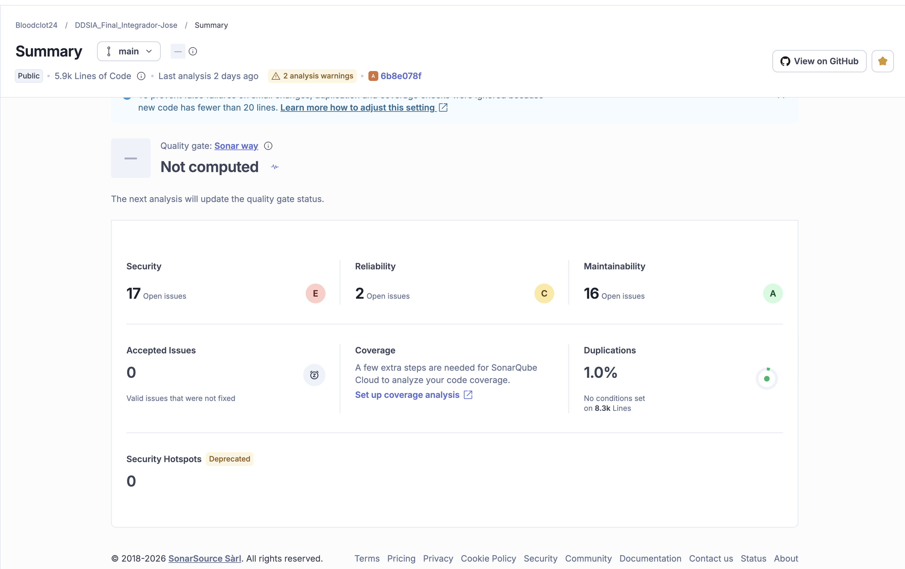
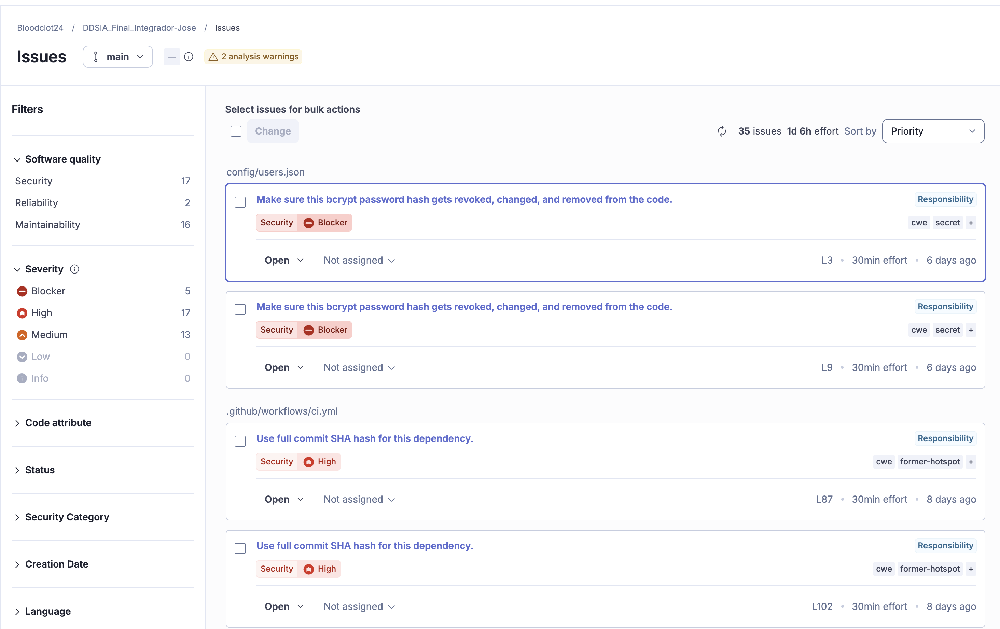
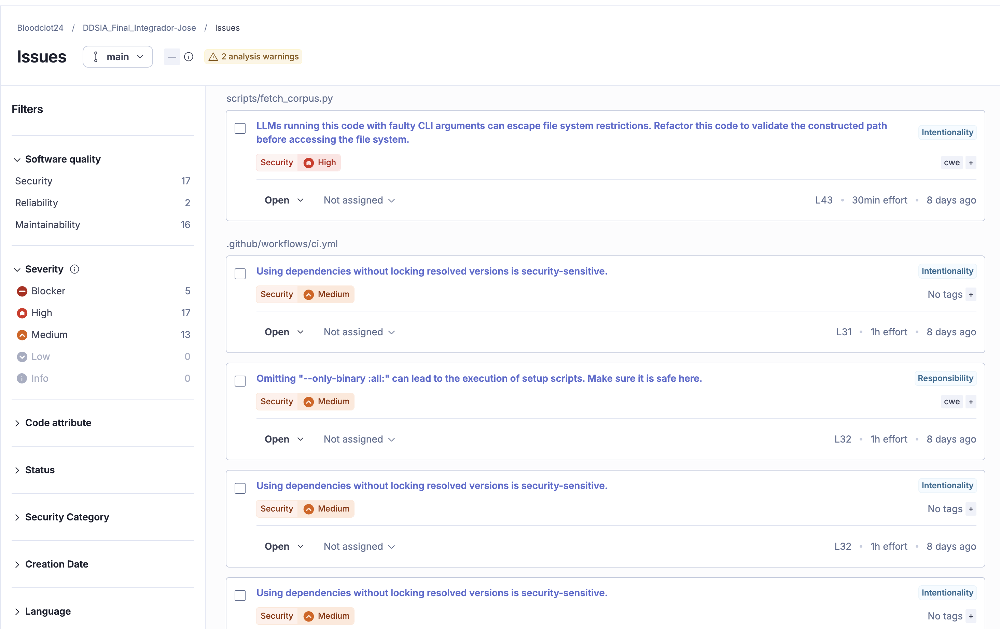
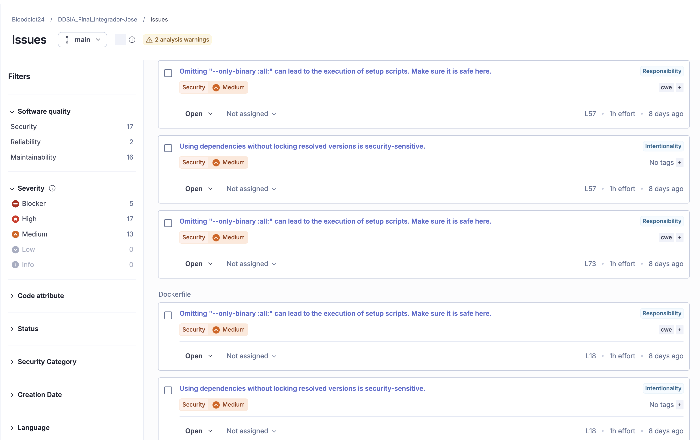
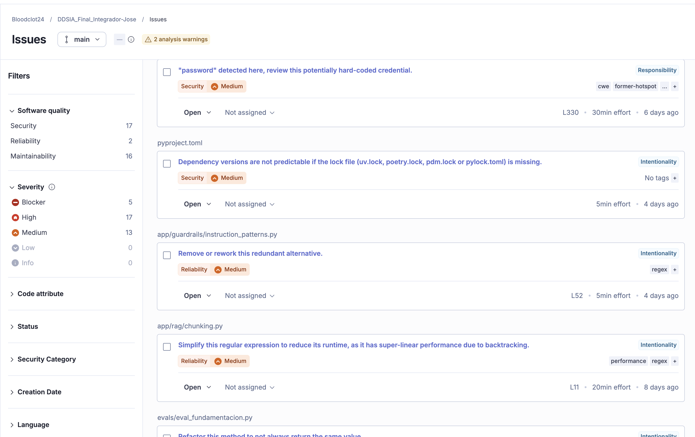
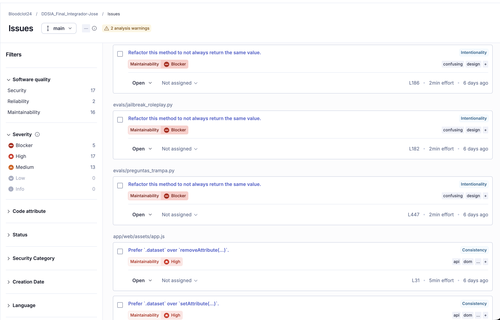
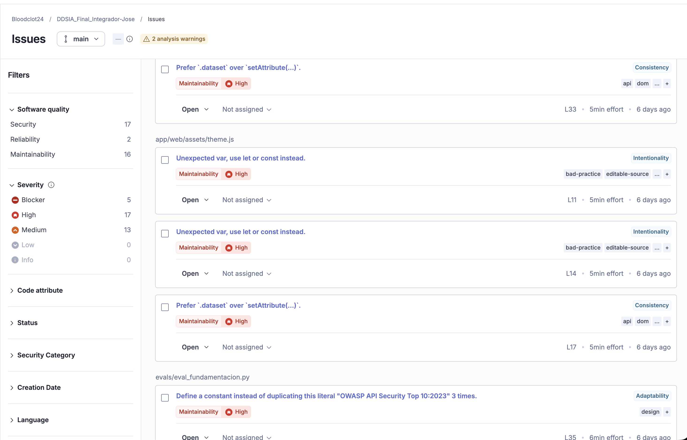
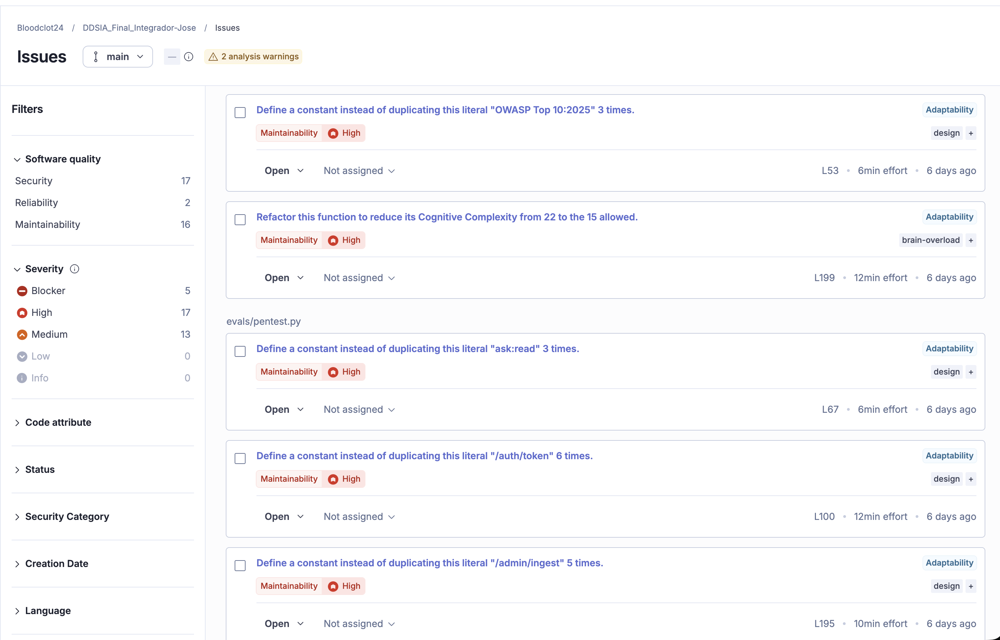
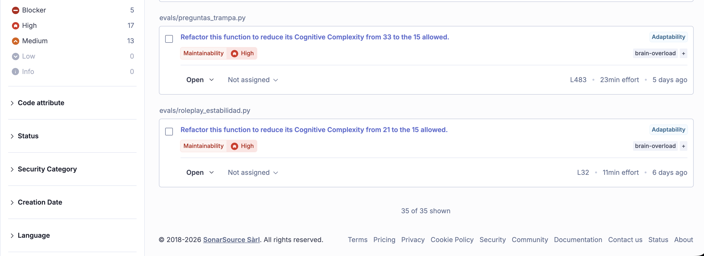


### 5.2. Gitleaks (Detección de Secretos)
**Comando utilizado:**
```bash
gitleaks detect --source . -r report.json -f json
```
**Captura de pantalla:**
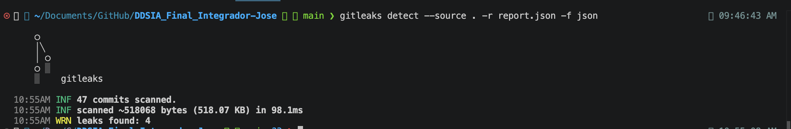

### 5.3. Bandit (Análisis Estático para Python)
**Comando utilizado:**
```bash
bandit -r app
```
**Captura de pantalla:**
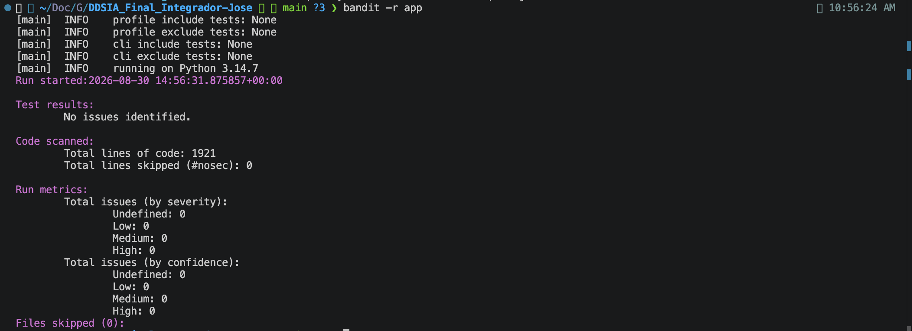

### 5.4. Hadolint (Linting de Dockerfiles)
**Comando utilizado:**
```bash
docker run --rm -i hadolint/hadolint < Dockerfile
```
**Captura de pantalla:**
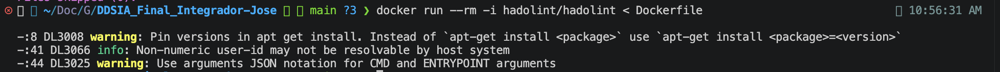


### 5.5. Trivy (Escaneo de Contenedores y Dependencias)
**Comando utilizado:**
```bash
trivy image --format template --template "@/opt/homebrew/share/trivy/templates/html.tpl" --output report.html owasp-rag-assistant:1.0.0 
```
**Captura de pantalla:**
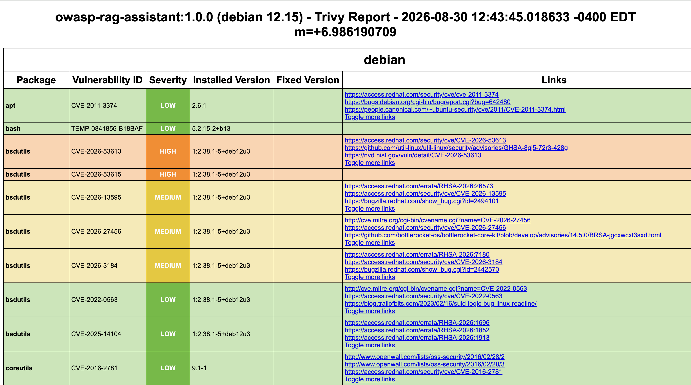
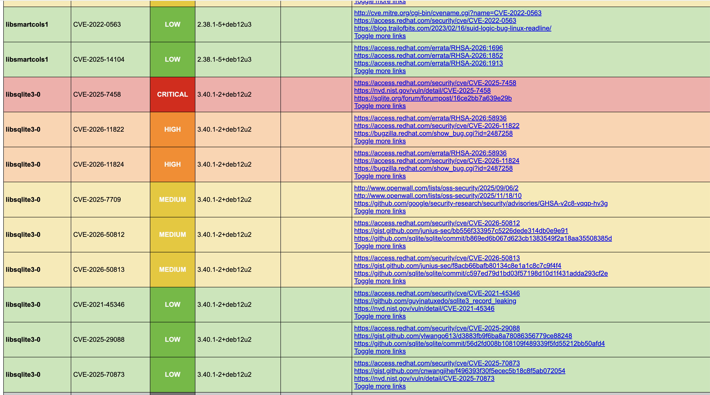

#### Resumen Ejecutivo de Vulnerabilidades - Trivy Scan

Este reporte resume los hallazgos principales del escaneo de seguridad de contenedores para la imagen `owasp-rag-assistant:1.0.0` (basada en Debian 12.15).

Se ha priorizado la enumeración de las vulnerabilidades **CRITICAL** y **HIGH** debido a su impacto directo en la infraestructura y las operaciones.

#### Vulnerabilidades Prioritarias (CRITICAL & HIGH)

| Nivel de Riesgo | ID de Vulnerabilidad (CVE) | Paquete Afectado | Versión Actual | Versión Corregida (Parche) |
| :--- | :--- | :--- | :--- | :--- |
| **CRITICAL** | CVE-2025-7458 | `libsqlite3-0` | 3.40.1-2+deb12u2 | - |
| **HIGH** | CVE-2026-53613 / 53615 | `bsdutils`, `libblkid1` (y dependencias)* | 1:2.38.1-5+deb12u3 | - |
| **HIGH** | CVE-2026-41992 | `gzip` | 1.12-1 | - |
| **HIGH** | CVE-2026-54369 | `libacl1` | 2.3.1-3 | - |
| **HIGH** | CVE-2026-11822 / 11824 | `libsqlite3-0` | 3.40.1-2+deb12u2 | - |
| **HIGH** | CVE-2025-69720 | `libncursesw6`, `libtinfo6`** | 6.4-4 | - |

*\* Afecta también a `libmount1` y `libuuid1`.*
*\*\* Afecta a bibliotecas de manejo de terminales.*

#### Análisis de Nivel Medio y Bajo (MEDIUM & LOW)
Las imágenes contienen un volumen significativo de hallazgos de menor criticidad (MEDIUM, LOW, UNKNOWN). Las superficies más afectadas incluyen:
* **MEDIUM:** 38 vulnerabilidades detectadas en componentes esenciales como `libc-bin`, `libc6` (`CVE-2026-5435`, `CVE-2026-5450`, `CVE-2026-6238`), utilidades de `bsdutils`, `gpgv`, `libattr1` y `libbz2-1.0`.
* **LOW:** 56 vulnerabilidades en herramientas del sistema operativo base como `apt`, `coreutils`, `bash`, `diffutils` y `libssl3`.

#### Recomendaciones de Remediación
1. **Actualizar Paquetes Críticos:** Es imperativo actualizar `libsqlite3-0` para mitigar la vulnerabilidad crítica (`CVE-2025-7458`) y las de nivel alto (`CVE-2026-11822`, `CVE-2026-11824`).
2. **Actualizar Utilidades del Sistema (Util-linux y gzip):** Aplicar parches a las librerías base de manipulación de almacenamiento y compresión (`bsdutils`, `libblkid1`, `gzip`) para cerrar las brechas de severidad alta.
3. **Reconstrucción del Contenedor:** Ejecutar un `apt-get update && apt-get upgrade` en el Dockerfile para incorporar los parches oficiales de seguridad más recientes disponibles para Debian 12.

### 5.6. OWASP ZAP (Análisis Dinámico - DAST)
**Comando utilizado:**
```bash
docker run --rm -v $(pwd):/zap/wrk/:rw --network="host" -t zaproxy/zap-stable zap-full-scan.py -t http://localhost:8000 -r owasp-report.html
```
**Captura de pantalla:**
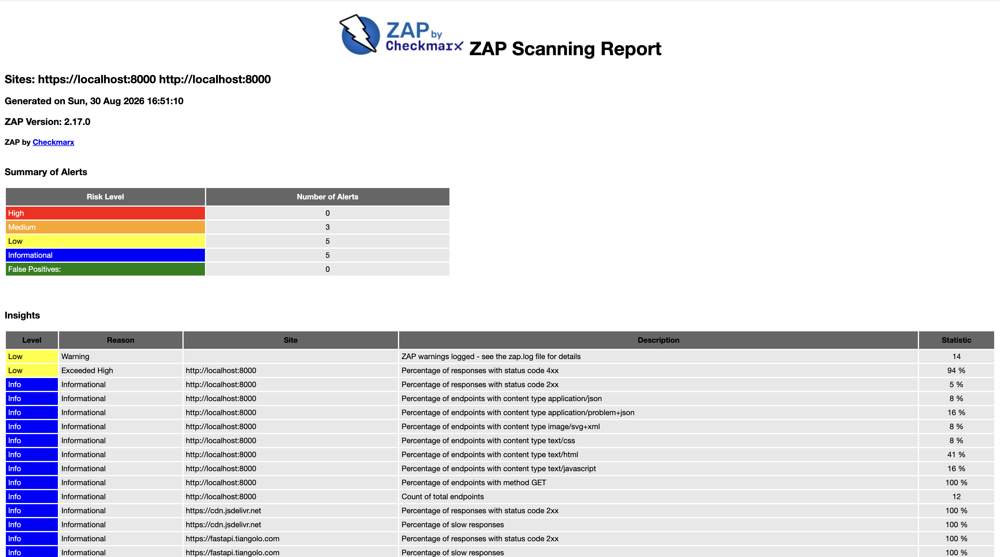
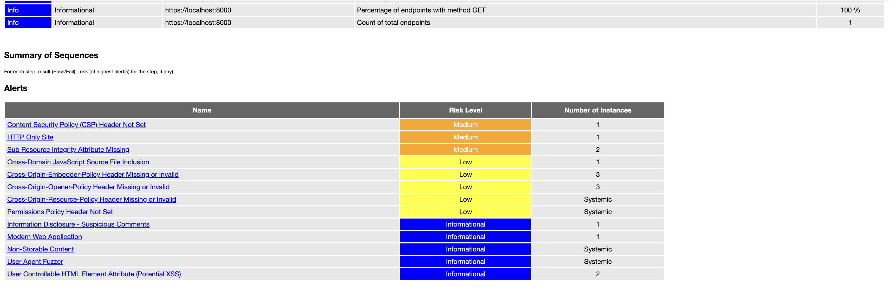
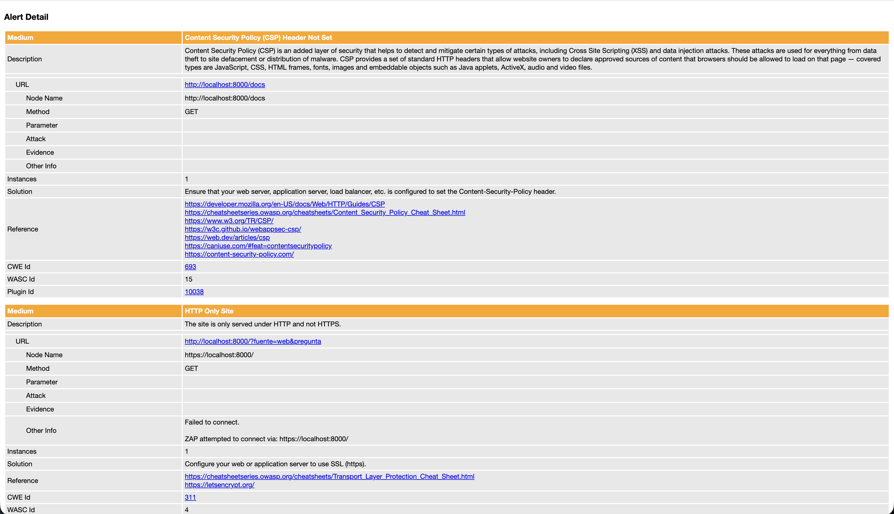
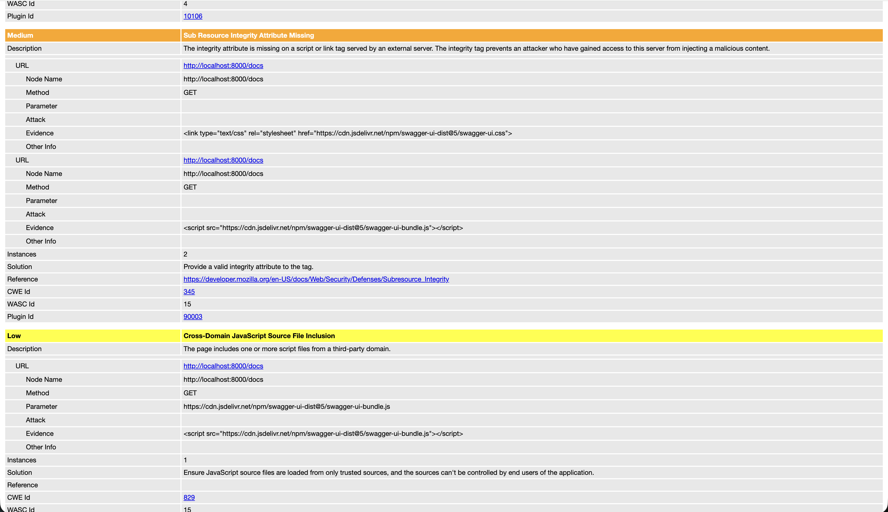
