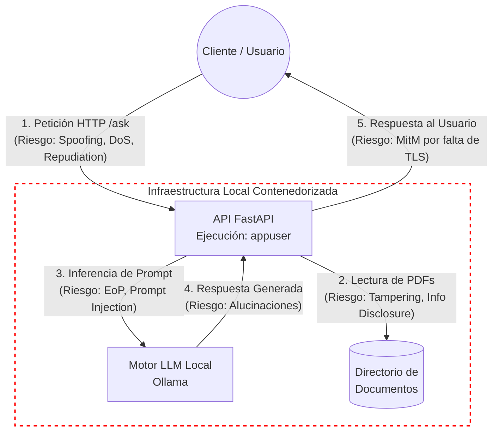

**Mapeo de Amenazas y Mitigaciones (STRIDE & Riesgos IA)**

| Categoría | Amenaza Identificada | Mitigación Implementada | Riesgo Residual |
| :--- | :--- | :--- | :--- |
| **Spoofing** | Suplantación de identidad para consumir la API. | Exigencia de API Key en los headers validada por FastAPI. | N/A |
| **Tampering** | Modificación maliciosa del código o documentos fuente. | Contenedores inmutables y permisos de solo lectura sobre el directorio de documentos. | N/A |
| **Repudiation** | Negación de acciones maliciosas. | Logs estructurados registrando IP del cliente y tipo de evento. | N/A |
| **Information Disclosure** | Fuga de datos hacia proveedores externos. | Uso de LLM (Ollama) y embeddings locales asegurando cero exfiltración de datos. | Intercepción por falta de cifrado en tránsito (HTTP sin TLS). |
| **Denial of Service** | Agotamiento de recursos locales (CPU/RAM) mediante inundación de peticiones. | Rate Limiting estricto (5 peticiones por minuto) con slowapi. | Agotamiento de recursos por falta de límites a nivel Docker. |
| **Elevation of Privilege** | Ejecución de código arbitrario para tomar control del host. | Hardening del contenedor ejecutando procesos como usuario no privilegiado (appuser). | N/A |
| **Riesgos IA** | Intentos de Prompt Injection. | Guardrails mediante validación de Pydantic y lista negra de palabras. | Jailbreaks complejos, alucinaciones y envenenamiento de contexto. |    